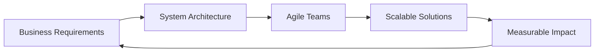

<div align="center">
  
</div>

<h3 align="center">Software Engineering Manager | Cloud & Agile Delivery | AI & Machine Learning Engineering | Scalable Systems Architecture</h3>

<p align="center">
  <a href="https://www.linkedin.com/in/evertondavid/"></a>
  <a href="https://x.com/everton_david"></a>
  <a href="mailto:evertondavid@outlook.com"></a>
</p>

---

### 👨‍💻 About Me

```typescript
const everton = {
  role: "Software Engineering Manager",
  location: "Brazil 🇧🇷",
  experience: "15+ years",
  
  education: {
    bachelor: {
      degree: "Information Systems",
      level: "Bachelor's Degree"
    },
    postgraduate: [
      {
        degree: "Project Management",
        institution: "FIAP",
        level: "Postgraduate"
      },
      {
        degree: "Leadership and Strategic People Management",
        institution: "FIA",
        level: "Postgraduate"
      }
    ],
    diploma: {
      program: "Software Engineering",
      institution: "NBCC",
      location: "Canada 🇨🇦"
    }
  },
  
  focus: [
    "Software Architecture & System Design",
    "AI & Machine Learning Engineering",
    "DevOps & Cloud Solutions",
    "Team Leadership & Agile Transformation"
  ],
  
  achievements: {
    nps: 90,
    churnRate: "<5%",
    grossMargin: "~35%",
    teamsManaged: "40+ professionals"
  },
  
  currentlyLearning: ["Advanced ML Models", "Cloud Native Patterns"],
  openToCollaborate: true
};
```

### 🚀 Professional Highlights

- 🎯 **Bridge Builder**: Connecting architecture, business, and agile teams to deliver scalable solutions
- 📊 **Metrics-Driven Leader**: Managing teams with KPIs and measurable impact
- ☁️ **AWS Certified**: Deep expertise in cloud architecture and system design
- 🏗️ **Clean Architecture Advocate**: Applying SOLID principles for robust, high-performance systems
- 🤖 **AI Integration**: Leveraging LLMs and automation to enhance development workflows

---

### 🛠️ Tech Stack

#### **Backend Development**
<p>
  
  
  
  
  
</p>

#### **Frontend Development**
<p>
  
  
  
  
  
  
</p>

#### **Databases**
<p>
  
  
</p>

#### **Cloud & DevOps**
<p>
  
  
  
  
  
</p>

#### **AI & Automation**
<p>
  
  
  
</p>

#### **Agile & Project Management**
<p>
  
  
</p>

---

### 📊 GitHub Stats

<p align="center">
  
  
</p>

<p align="center">
  
</p>

---

### 🏆 Certifications & Achievements

- ☁️ **AWS Certified** - Cloud Architecture & Solutions
- 🎯 **Atlassian Certified Professional (ACP)** - Jira Administration
- 📈 **Team Success Metrics**: NPS 90 | Churn <5% | 35% Gross Margin
- 👥 **Leadership**: 40+ professionals managed across multiple teams

---

### 💼 What I Do Best



- **Architectural Leadership**: Design and implement scalable, secure systems using Clean Architecture and SOLID principles
- **Team Empowerment**: Lead metrics-driven teams with focus on continuous improvement and delivery excellence
- **Cloud Solutions**: Architect and deploy production-ready applications on AWS with high availability
- **AI Integration**: Implement ML/AI solutions to enhance product capabilities and development workflows

---

### 🌱 Currently Exploring

- 🤖 Advanced Machine Learning architectures and LLM integration patterns
- ☁️ Cloud-native patterns and serverless architectures
- 🎓 Enhancing my Software Engineering knowledge at NBCC
- 🌐 Building and sharing open-source projects

---

### 📫 Let's Connect!

I'm always interested in connecting with fellow developers, tech leaders, and innovators. Whether you want to discuss technology, collaboration opportunities, or just chat about software engineering, feel free to reach out!

<p align="center">
  <a href="https://www.linkedin.com/in/evertondavid/">
    
  </a>
</p>

---

<div align="center">
  
</div>

<div align="center">
  
  **⭐️ From [evertondavid](https://github.com/evertondavid) with ❤️**
  
</div>
